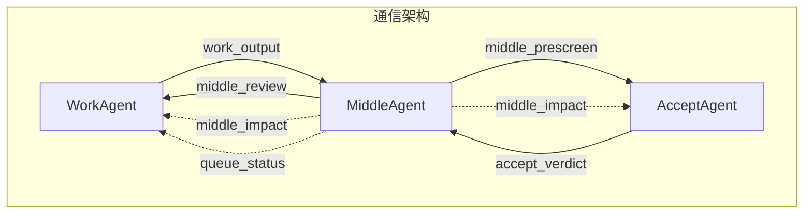

# PlanMode + DualAgentFlow 架构图

```mermaid
flowchart TB
    subgraph Phase1["Phase 1 规划阶段"]
        U[👤 用户] -->|触发| PM[📋 Plan Mode<br/>选项生成 + 章节分解]
        PM -->|输出计划| PF[📄 plan-{ts}/ 计划文件]
    end

    subgraph Phase2["Phase 2 执行阶段"]
        WA[🔧 WorkAgent 生产者<br/>按章节生成产出<br/>分支修复 / 依赖等待<br/>进度领先 ≤ 4 节]

        MA[⚖️ MiddleAgent 仲裁<br/>① 预审总结<br/>② 连锁影响预判<br/>③ 复核验收结论<br/>④ 版本 & 状态管理<br/>⑤ 每5节快照写入]

        AA[✅ AcceptAgent 验收<br/>FIFO 队列（上限5）<br/>自推理验证<br/>版本淘汰机制]

        WA -->|产出通知| MA
        MA -->|预审后产出| AA
        AA -->|验收结论| MA
        MA -->|复核后结论| WA

        MA -.->|影响预判| WA
        MA -.->|影响预判| AA
    end

    subgraph Phase3["Phase 3 持久化层"]
        M[📁 main/ 主干目录]
        B[📁 branches/ 分支目录]
        S[📸 snapshots/ 快照记录]
    end

    PF -->|读取计划| WA
    WA -->|写入产出| M
    WA -->|创建分支| B
    MA -->|每5节快照| S
```

## 消息流向



## 消息格式

```json
{
  "type": "work_output | middle_prescreen | middle_impact | accept_verdict | middle_review | queue_status",
  "from": "work_agent | middle_agent | accept_agent",
  "chapter": "chapter_X",
  "branch_id": "branch_YYYYMMDD_HHMMSS_xxx",
  "version": 1,
  "payload": {},
  "depends_on": ["chapter_X-1"],
  "timestamp": "2026-06-16T18:00:00+08:00"
}
```

## 分支目录结构

```
workspace/
├── plan-20260616/
│   ├── chapter_1.md
│   ├── chapter_2.md
│   └── plan_complete.md
├── main/
│   ├── chapter_1/
│   ├── chapter_2/
│   └── .../
├── branches/
│   └── fix-chapter_2-20260616-180500/
│       ├── chapter_2/
│       └── .../
├── snapshots/
│   └── snapshot-20260616-180000.json
└── errors/
    └── error_summary.md
```

## 模型配置

| 角色 | 模型 | API | 端点 |
|------|------|-----|------|
| **PlanMode**（执行模型） | `deepseek-v4-pro` | 默认 API | 默认 |
| **WorkAgent** | `gemini-3.1-flash-lite` | `$IMAGE_GEN_API_KEY` | `https://grsai.dakka.com.cn/v1/chat/completions` |
| **MiddleAgent** | `gpt-5.4` | `$IMAGE_GEN_API_KEY` | `https://grsai.dakka.com.cn/v1/chat/completions` |
| **AcceptAgent** | `deepseek-v4-pro` | 默认 API | 默认 |

## 图例

| 颜色 | 含义 |
|------|------|
| 蓝色 | 规划 / 验收 |
| 紫色 | 执行 / 生产 |
| 灰色 | 仲裁 / 存储 |
| 橙色 | 分支 / 用户 |
| 虚线 | 预判消息 |
